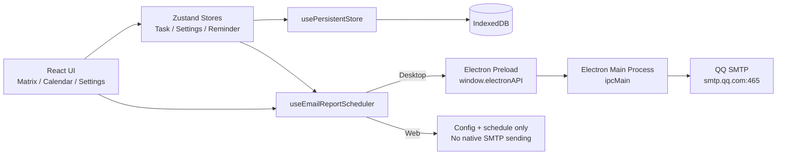

# Core Matrix（艾森豪威尔矩阵任务管理）

Core Matrix 是一个基于艾森豪威尔矩阵（重要/紧急）的方法论任务管理应用，支持：

- 矩阵视图任务管理（Q1/Q2/Q3/Q4）
- 日历月视图与甘特图拖拽调整
- 本地数据持久化（IndexedDB）
- Electron 桌面打包（Windows 一键安装）
- 按“开始日期 + 每 N 天 + 指定时间”的邮件摘要推送（QQ SMTP）

English summary:

Core Matrix is an Eisenhower Matrix based task manager with matrix board, calendar + Gantt, local persistence, Electron desktop packaging, and scheduled QQ SMTP email summaries.

---

## 1. 技术栈

- 前端：React 18 + TypeScript + Vite
- 路由：React Router
- 状态管理：Zustand
- 日期处理：date-fns
- 本地存储：idb（IndexedDB）
- 桌面端：Electron + electron-builder
- 邮件发送：nodemailer（通过 Electron 主进程调用 QQ SMTP）
- 测试：Vitest + Testing Library

### 1.1 系统架构图（Architecture Diagram）



---

## 2. 目录结构（核心）

```text
.
├─ electron/
│  ├─ main.ts                 # Electron 主进程（窗口、IPC、SMTP发送）
│  └─ preload.ts              # 预加载脚本，暴露安全 API 给渲染进程
├─ scripts/
│  └─ prepare-electron-main.cjs  # 生成 main.cjs 入口
├─ src/
│  ├─ features/
│  │  ├─ matrix/              # 矩阵视图
│  │  ├─ calendar/            # 日历与甘特图
│  │  ├─ reminders/           # 提醒模块
│  │  └─ settings/            # 设置页（包含邮件推送配置）
│  ├─ hooks/
│  │  ├─ usePersistentStore.ts
│  │  └─ useEmailReportScheduler.ts
│  ├─ services/
│  │  └─ emailReportService.ts
│  ├─ storage/
│  │  ├─ indexedDbClient.ts
│  │  └─ storageAdapter.ts
│  ├─ store/
│  │  ├─ taskStore.ts
│  │  └─ settingsStore.ts
│  └─ routes/
│     ├─ config.tsx
│     └─ index.tsx
├─ package.json
├─ tsconfig.electron.json
└─ vite.config.ts
```

---

## 3. 功能清单

### 3.1 任务与矩阵

- 任务支持重要性/紧急性 1-10 分
- 自动映射象限：
  - Q1：重要且紧急
  - Q2：重要不紧急
  - Q3：紧急不重要
  - Q4：不重要不紧急
- 支持任务完成状态，已完成任务在矩阵中可隐藏

### 3.2 日历与甘特图

- 日历页只展示有有效 `dueDate` 的任务
- 甘特图支持：
  - 左侧拖拽调整 `startDate`
  - 右侧拖拽调整 `dueDate`
  - 中间拖拽整体平移区间

### 3.3 邮件摘要推送（新）

- 设置页可配置：
  - 启用开关
  - 发件 QQ 邮箱
  - QQ 授权码
  - 收件邮箱
  - 开始日期（起算点）
  - 发送时间（HH:mm）
  - 频率（每 N 天）
- 摘要内容（纯文本）：
  - 待办 / 进行中 / 已完成 / 逾期
  - Q1~Q4 象限分布

> 注意：SMTP 真正发送在 Electron 主进程完成；Web 端保持配置和调度同步，但无 Node SMTP 发送能力。

---

## 4. 环境要求

- Node.js 18+
- npm 9+
- Windows（打包安装包时）

---

## 5. 快速开始

### 5.1 安装依赖

```bash
npm install
```

### 5.2 启动 Web 开发模式

```bash
npm run dev
```

### 5.3 运行测试

```bash
npm run test -- --run
```

### 5.4 代码检查

```bash
npm run lint
```

### 5.5 构建 Web 产物

```bash
npm run build

### 5.6 English Quick Start

```bash
# Install
npm install

# Web dev
npm run dev

# Test
npm run test -- --run

# Lint
npm run lint

# Build
npm run build

# Electron dev
npm run electron:dev

# Electron package (Windows installer)
npm run electron:build
```
```

---

## 6. Electron 开发与打包

### 6.1 Electron 开发模式

```bash
npm run electron:dev
```

### 6.2 本地预览（生产构建 + Electron）

```bash
npm run electron:preview
```

### 6.3 打包 Windows 一键安装包

```bash
npm run electron:build
```

输出目录：

- `release/Core Matrix Setup 1.0.0.exe`

---

## 7. 安装与运行（Windows）

### 7.1 图形界面安装

双击：

- `release/Core Matrix Setup 1.0.0.exe`

### 7.2 静默安装

```bat
"D:\移动创新研究院工作\2026\opencode\agenttest\release\Core Matrix Setup 1.0.0.exe" /S
```

默认安装路径：

- `C:\Users\<你的用户名>\AppData\Local\Programs\core-matrix\`

---

## 8. QQ 邮箱 SMTP 配置说明

1. 登录 QQ 邮箱网页端
2. 进入“设置 -> 账户”
3. 开启 SMTP 服务
4. 获取授权码（不是登录密码）
5. 在应用设置页填入：
   - 发件邮箱：`xxx@qq.com`
   - 授权码：16位授权码
   - 收件邮箱：目标邮箱

SMTP 参数（代码内已固定）：

- Host: `smtp.qq.com`
- Port: `465`
- Secure: `true`

---

## 9. 调度规则（每 N 天）

调度由以下字段共同决定：

- `startDate`：起算日期
- `sendTime`：每日时刻（HH:mm）
- `intervalDays`：每 N 天

示例：

- 起算日：`2026-04-20`
- 时间：`09:30`
- N：`3`

则发送点为：

- 04-20 09:30
- 04-23 09:30
- 04-26 09:30
- ...

系统会记录上次发送时间，避免同一周期重复发送。

---

## 10. 常见问题（FAQ）

### Q1: 桌面端启动报 `exports is not defined`？

已通过 `main.cjs` 入口修复。请重新打包并重新安装最新安装包。

### Q2: 桌面端打开后显示 404？

已在 `file://` 场景切换为 Hash Router。请使用最新构建包。

### Q3: Web 端为什么没有自动发邮件？

浏览器环境没有 Node SMTP 能力。Web 端会同步配置与调度逻辑；实际 SMTP 发送在 Electron 桌面运行时执行。

### Q4: 我的 C 盘空间紧张怎么办？

可将 npm/electron-builder 缓存迁移到 D 盘，避免 C 盘持续增长。

---

## 11. 安全建议

- QQ 授权码属于敏感信息，请勿上传到 Git 或共享给他人
- 备份文件若包含设置项，请妥善保管
- 建议在个人设备使用本功能，避免多人共用同一系统账户

---

## 12. 维护命令速查

```bash
# 开发
npm run dev

# 测试
npm run test -- --run

# 质量检查
npm run lint

# Web构建
npm run build

# Electron开发
npm run electron:dev

# Electron预览
npm run electron:preview

# 打包安装包
npm run electron:build
```

---

## 13. 许可证

当前仓库未声明开源许可证，请按内部项目使用规则执行。
